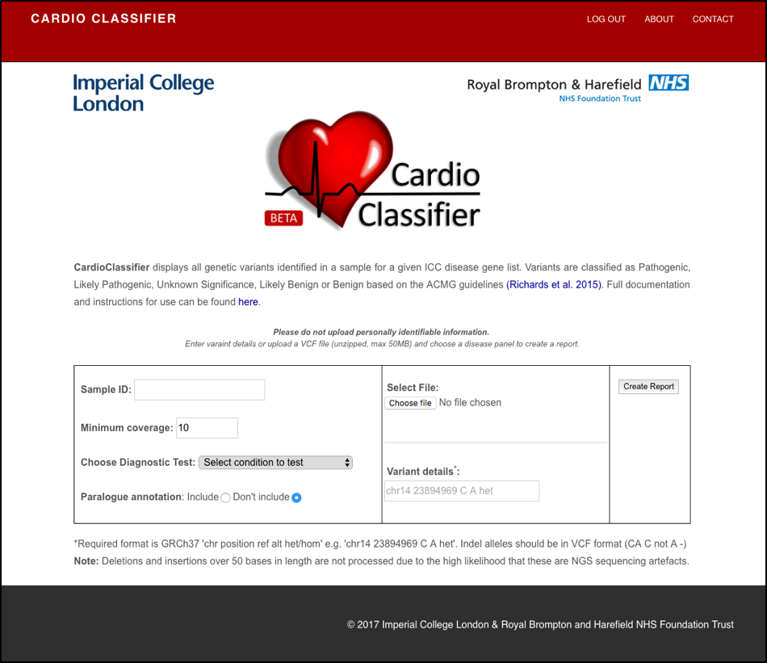
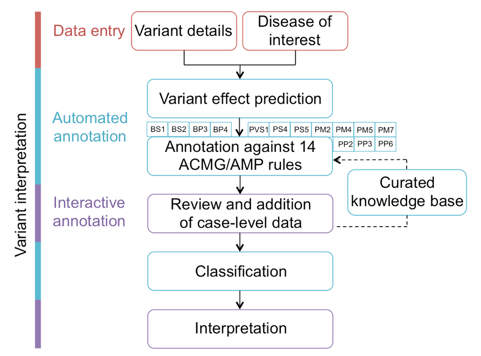
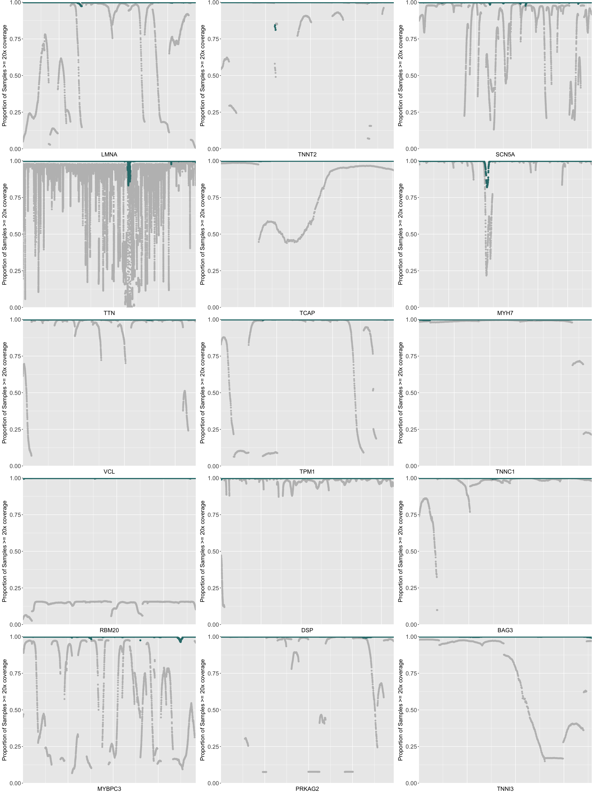
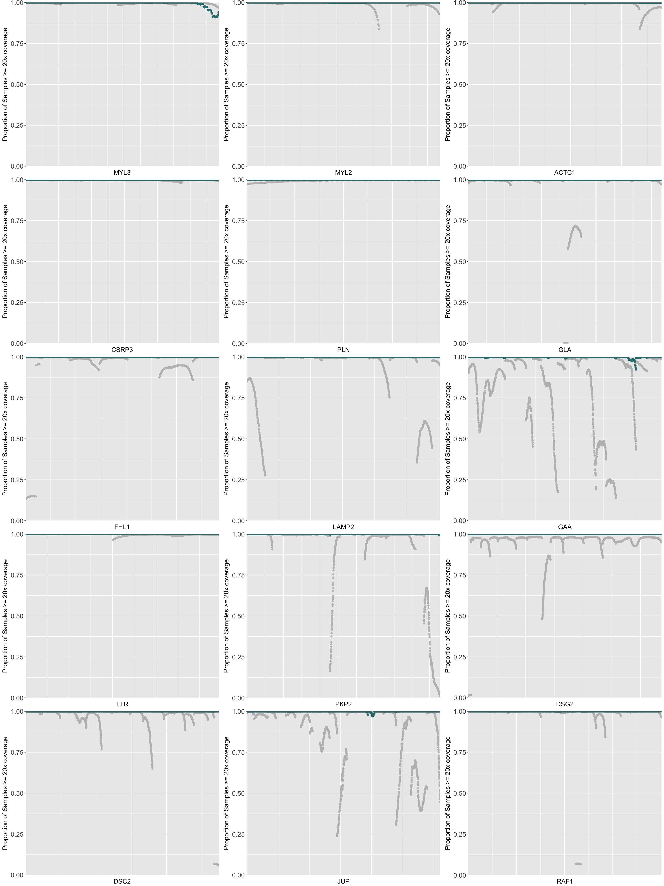
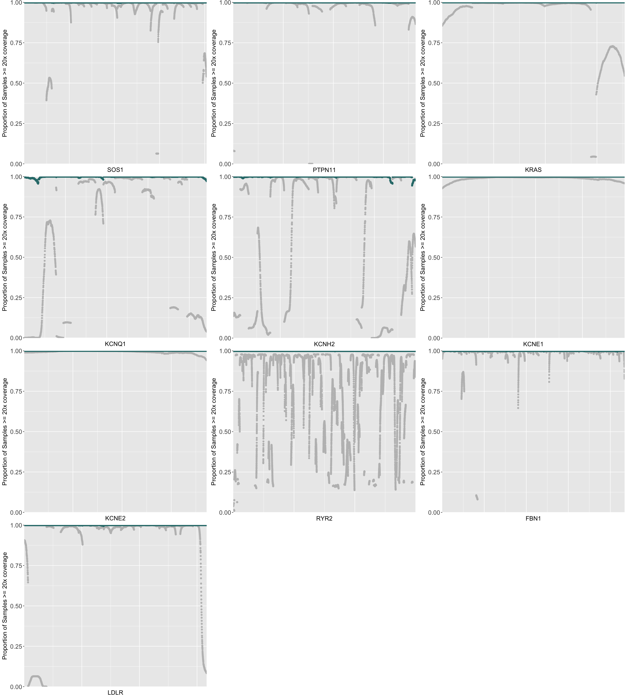
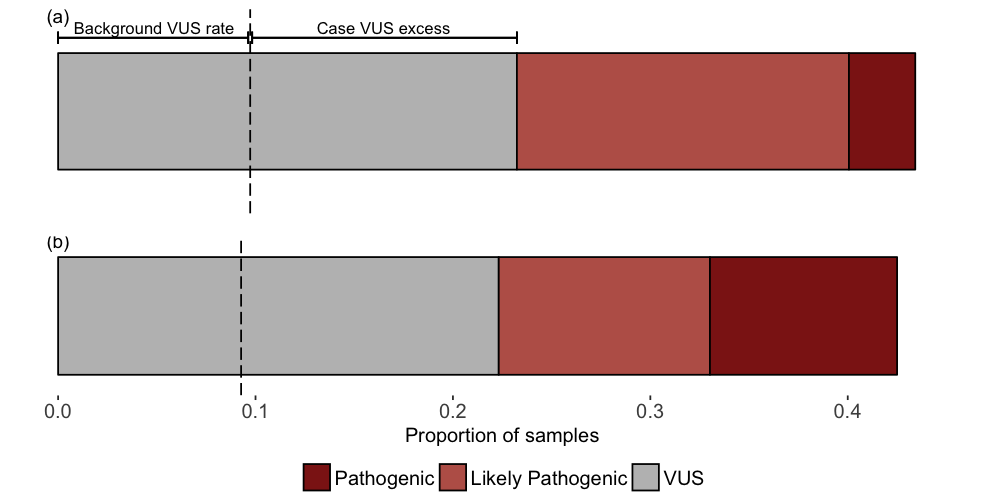

```{r, echo=FALSE, include=FALSE}
#load functions
source(file.path("..","R","setup.R"))
```

```{r authors, results='asis'}
read.delim("../data/authors.txt") %>%
  formatAuthors(infoText1="These authors jointly supervised this work",infoText2="Corresponding author")
```

**SUPPLEMENTARY INFORMATION**

## SUPPLEMENTARY NOTE 1 - Parameterisation of ACMG/AMP rules

CardioClassifier currently includes 11 ICCs for which we have solid estimates of both prevalence and heterogeneity in order to generate accurate maximum cut-offs for allele frequency filtering (activation of BS1/PM2) (http://www.nature.com/gim/journal/vaop/ncurrent/full/gim201726a.html). Genes selected for inclusion have definitive links to these ICCs, defined as one or more of the following:

-	Truncating variants in this gene activate PVS1 (method for determining this is outlined below)
-	The gene shows a significant excess of either truncating or non-truncating variants in disease cohorts over controls (http://www.nature.com/gim/journal/vaop/ncurrent/full/gim201690a.html)
-	Individual variants in this gene are significantly enriched in disease cohorts over controls (i.e. at least one variant activates PS4)
- The gene is common included on gene testing panels found in UKGTN and there are multiple pathogenic assertions in ClinVar for variants in this gene

Moving forwards, genes identified as strongly/definitively associated with an ICC by the ClinGen Cardiovascular Domain Working Group will be added as they can be parameterized.

### Rules activated consistently across all genes/diseases

The following rules are activated consistently, irrespective of the disease and gene analysed:

*PS1 – same amino acid change as previously established pathogenic variant*

Activated when a variant causing the same amino acid change is categorised as ‘Pathogenic’ for the phenotype of interest in ClinVar by multiple submitters with no conflicting evidence. If data is from only a single submitter, it is displayed on the report but is not used to activate PS1.

*PM4 – protein length changes as a result of in-frame deletions/insertions in a non-repeat region or stop-lost variants*

Activated if the variant is annotated as ‘stop-lost’ or ‘in-frame indel’ by the Ensembl Variant Effect Predictor (VEP). For in-frame indels the rule is only activated if the variant is not within a region annotated by repeat masker.

*PM5 – novel missense change at an amino acid residue where a different missense change has previously been determined to be pathogenic*

Activated when a different missense variant at the same residue is categorised as ‘Pathogenic’ for the phenotype of interest in ClinVar by multiple submitters with no conflicting evidence. If data is from only a single submitter, it is displayed on the report but is not used to activate PM5.

*PP3 – multiple lines of computation evidence support a deleterious effect on the gene or gene product*

The following eight prediction algorithms are used: SIFT, PolyPhen2 var, LRT, Mutation Taster, Mutation Assessor, FATHMM, CADD and Grantham scores. The rule is activated when the following conditions are met:

1. At least five tools predict deleterious, with at most 1 tool predicting benign, and <3 with “unknown” classifications

*or*

2. If >=3 tools have unknown outcomes, all other tools predict damaging

*BA1 – allele frequency is >5%*

Due to the rarity of our disorders this threshold was reduced and this rule is activated for all variants with a filtering allele frequency (http://www.nature.com/gim/journal/vaop/ncurrent/full/gim201726a.html) >0.1% for heterozygotes or >3.16% (sqrt(0.001)) for homozygotes in the exome aggregation consortium (ExAC) database. We also use a set of internal healthy volunteers from the UK to detect Illumina platform specific errors. As this is a small dataset we use a threshold of 5% and activate BA1 if a variant is rare/absent from ExAC but present in >5% of healthy volunteers.

*BP3 - in-frame deletions/insertions in a repetitive region without known function*

Activated for any in-frame insertion or deletion that falls within a region annotated by repeat masker.

*BP4 - multiple lines of computational evidence suggest no impact on gene or gene product*

The following eight prediction algorithms are used: SIFT, PolyPhen2 var, LRT, Mutation Taster, Mutation Assessor, FATHMM, CADD and Grantham scores. The rule is activated when the following conditions are met:

1. At least five tools predict benign, with at most 1 tool predicting deleterious, and <3 with “unknown” classifications

*or*

2. If >=3 tools have unknown outcomes, all other tools predict benign

### Disease/gene specific rules

The following rules are activated for certain genes or diseases where data was available for analysis:

*PVS1 - null variant in a gene where Loss of Function (LoF) is a known mechanism of disease*

Activated for gene/disease pairs that meet one or more of the following conditions:

1. Genes with a significant burden of truncating variants in cases against controls from analysis of 7,855 cardiomyopathy cases and 60,706 controls (http://biorxiv.org/content/early/2016/02/24/041111)
2. Genes with an excess of truncating variants in HGMD over ExAC
3. Phenocopy genes where 2. is true

PVS1 is therefore activated for the following gene-disease pairs:

| Disease          | Gene     | Condition met |
| ---------------- | -------- | ------------- |
| DCM              | *LMNA*   |             1 |
| DCM              | *DSP*    |             1 |
| DCM              | *VCL*    |             1 |
| DCM              | *BAG3*   |             2 |
| HCM              | *MYBPC3* |             1 |
| HCM              | *TNNT2*  |             1 |
| HCM              | *PLN*    |             1 |
| HCM              | *FHL1*   |             2 |
| HCM              | *GLA*    |             3 |
| HCM              | *LAMP2*  |             3 |
| ARVC/D           | *DSP*    |             1 |
| ARVC/D           | *DSG2*   |             1 |
| ARVC/D           | *DSC2*   |             1 |
| ARVC/D           | *PKP2*   |             1 |
| ncCM             | *TAZ*    |             2 |
| LQTS             | *KCNQ1*  |             2 |
| LQTS             | *KCNH2*  |             2 |
| Brugada syndrome | *SCN5A*  |             2 |
| Marfan syndrome  | *FBN1*  |             2 |
| FH               | *LDLR*   |             2 |

NB: For this rule, truncating variants were taken as a proxy for variants that cause LoF. Care must be taken to ensure confidence that the given variant does indeed cause LoF.

*PVS1_strong - TTN truncating variant in a constitutively expressed exon*

This rule was created specifically for analysing variants in the TTN gene where truncating variants are only known to cause disease if located in exons that are constitutively expressed in the heart (i.e. PVS1 doesn’t always apply). It is activated within a DCM test for nonsense, frameshift and essential splice site variants in TTN within exons with proportion spliced in (PSI) >0.9. Details of PSI calculation can be found in: http://www.ncbi.nlm.nih.gov/pubmed/25589632.

*PS4 - the prevalence of the variant in affected individuals is significantly increased compared with controls*

This rule has been assessed for DCM, HCM, ARVD/C, Brugada syndrome and LQTS using variants from the following publications:

| Disease          | Publication                                                          |
| -------          | -------------------------------------------------------------------- |
| DCM, HCM, ARVD/C | http://www.nature.com/gim/journal/vaop/ncurrent/full/gim201690a.html |
| LQTS             | https://www.ncbi.nlm.nih.gov/pubmed/19716085                         |
| Brugada syndrome | http://www.ncbi.nlm.nih.gov/pubmed/20129283                          |

A Fisher’s exact test was used to test for association against the ExAC dataset. If a variant does not exist in ExAC, the total count of individuals is taken as the proportion covered at >=15x at the variant position. A Bonferroni correction based on the number of rare variants (freq <0.0001) across all tested genes in either ExAC or the case cohort, was used to assess statistical significance. This rule is activated if the count in the cases was >2 and the Fisher’s *P*<1.79x10-6.

*PM1 - located in a mutational hot-spot and/or critical and well-established functional domain*

The following gene-disease pairs have been analysed for this rule with data obtained from the reference in the table:

| Disease          | Gene(s)                   | Publication                                                    |
| ---------------- | ------------------------- | -------------------------------------------------------------- |
| LQTS             | *KCNQ1*, *KCNH2*, *SCN5A* | https://www.ncbi.nlm.nih.gov/pubmed/19716085                   |
| Brugada syndrome | *SCN5A*                   | http://www.ncbi.nlm.nih.gov/pubmed/20129283                    |
| HCM              | *MYH7*                    | http://www.nature.com/gim/journal/vaop/ncurrent/full/gim201690a.html |
| CPVT             | *RYR2*                    | http://www.ncbi.nlm.nih.gov/pubmed/199260154                   |
| DCM              | *RBM20*                   | https://www.ncbi.nlm.nih.gov/pmc/articles/PMC2782634/          |
| Marfan syndrome | *FBN1*                    | http://www.cell.com/ajhg/fulltext/S0002-9297(07)62603-2        |

For RYR2 the regions used are directly taken from the reference, these are the ‘N terminal hot-spot’, the ‘Central hot-spot’ and the ‘Channel region hot-spot’. For *RBM20*, PM1 is activated for missense mutations in the 9 amino acid hotspot identified by Brauch et al. For *FBN1*, EF-like domains were identified using http://www.umd.be/FBN1/ and PM1 is activated for missense mutations affecting a cysteine residue.

For the other gene-disease pairs, variant frequencies from the references were compared with frequencies in the ExAC dataset over a set of defined regions. For the arrhythmia genes, regions were previously defined protein domains and the highly conserved regions of the *KCNQ1* C-terminus http://www.ncbi.nlm.nih.gov/pubmed/25854863. For MYH7, clusters were calculated from the data itself.

This rule was activated if the variant was within a region with etiological fraction (i.e. the estimated proportion of cases with a variant where the variant is causative, essentially equivalent to a prior probability of pathogenicity) ≥0.95 with Fisher’s exact P<0.05. Variants in regions with 0.75<EF<0.5 activate PP2 as described below.

*PM2 - absent/low frequency in controls*

Activated if the ExAC filtering allele frequency is less than the calculated maximum tolerated allele frequency for the disease. Details on how the maximum tolerated AF and filtering AF are determined can be found here: http://www.nature.com/gim/journal/vaop/ncurrent/full/gim201726a.html

NB: be aware that population data for insertions/deletions may be poorly covered. We do not currently check there is coverage at positions where no variant is found.

*BS1 - allele frequency is greater than expected for disorder*

Activated if the ExAC filtering allele frequency is greater the calculated maximum tolerated allele frequency for the disease. Details on how the maximum tolerated AF and filtering AF are determined can be found here: http://www.nature.com/gim/journal/vaop/ncurrent/full/gim201726a.html

*PP2 – missense variant in a gene with a low rate of benign missense variation and in which missense variants are a common mechanism of disease*

We use PP2 to activate both gene regions with lower confidence than PM1 (i.e. EF ≥0.75) or genes that are both constrained and where missense variants are commonly disease causing.

For the LQTS, Brugada syndrome and HCM genes in PM1, PP2 is activated where EF ≥0.75 and Fisher’s exact P<0.05.

For all other genes involved in DCM, HCM and ARVD/C, PP2 activation is based on data from http://www.nature.com/gim/journal/vaop/ncurrent/full/gim201690a.html and the ExAC database for genes with missense etiological fraction (i.e. the estimated proportion of cases with a variant where the variant is causative, essentially equivalent to a prior probability of pathogenicity) ≥0.75 with Fisher’s exact P<0.05.

Finally, we activate PP2 for two additional genes that are constrained in ExAC (missense Z score > 3.09) and where missense mutations are a common disease mechanism. These are FBN1 in Marfan syndrome and PTPN11 for Noonan syndrome.

As we see PP2 as a lower confidence version of PM1, this rule is never activated if PM1 is already used.

**Paralogue annotation**

For genes with paralogues that are known to be involved in disease, variants at equivalent residues in these paralogues can identify residues that are likely intolerant to variation and hence may be more likely to harbour disease causing variants. We use previously published data (http://jmg.bmj.com/content/early/2013/10/17/jmedgenet-2013-101917.full) to activate two rules relating to variants at equivalent residues and the same amino acid change at these residues. Only variants with high-confidence mapping to a paralogous gene are used (M-coffee mapping score >3 and the same reference amino acid). These rules are relevant to all genes currently analysed for LQTS, Brugada syndrome and CPVT. Further information is available at http://cardiodb.org/Paralogue_Annotation/. 

*PS1_moderate - Equivalent amino acid change as an established pathogenic variant in a paralogous gene*

*PM5_supporting - Missense change at an amino acid residue where a pathogenic missense change has been seen in the equivalent residue of a paralogous gene*

As we use these rules in the same way as PS1 and PM5, but treating evidence in paralogues as weaker than evidence in the same gene, these rules are never activated if either PS1 or PM5 are already active.

NB: As this data currently uses variants ‘reported’ in HGMD as pathogenic that have not been manually curated, it is important to verify whether the report of pathogenicity for the observation in the paralogue is robust. 

### User only rules

The following rules represent clinical data or data that requires manual curation, and hence are not currently computationally predicted/activated for any genes or diseases. These rules will be activated if data has been manually entered into the CardioClassifier knowledge base, or can be activated interactively at the user's discretion.

| Rule | Description                                 |
| ---- | ------------------------------------------------------------------------------------------------ |
| PS2  | *de novo* (both maternity and paternity confirmed) in a patient with disease and no family history |
| PS3  | well-established *in vitro* or *in vivo* functional studies supportive of a damaging effect          |
| PM3  | for recessive disorders, detected in trans with a pathogenic variant                             |
| PM6  | assumed *de novo*, but without confirmation of paternity and maternity                             |
| PP1  | co-segregation with disease in multiple affected family members in a gene definitively known to cause disease |
| PP4  | patient’s phenotype or family history is highly specific for a disease with a single genetic aetiology |
| PP5  | reputable source recently reports a variant as pathogenic, but the evidence is not available to perform an independent evaluation |
| BS2  | observed in a healthy individual with full penetrance expected at an early age                   |
| BS3  | well-established *in vitro* or *in vivo* functional studies show no damaging effect on protein function or splicing |
| BS4  | lack of segregation in affected members of a family                                              |
| BP1  | missense variant in a gene for which primarily truncating variants are known to cause disease    |
| BP2  | observed in trans with a pathogenic variant for a fully penetrance dominant gene/disorder or observed in cis with a pathogenic variant in any inheritance pattern |
| BP5  | variant found in a case with an alternative molecular basis for disease                          |
| BP6  | reputable source recently reports variant as benign, but the evidence is not available to perform an independent evaluation |

In addition, the tool does not currently annotate synonymous variants so rule BP7 is not utilised.

## SUPPLEMENTARY NOTE 2

### Benchmarking against manually curated variants

As part of the developmental process, we compared CardioClassifier to an orthogonally curated dataset of 44 protein-altering variants from patients referred to the Clinical Genetics and Genomics Laboratory at the Royal Brompton and Harefield NHS Trust, that had been manually curated according to the ACMG/AMP guidelines as part of routine clinical service.

Of 153 data points activated by the clinical lab, 19 represented case-level/functional data which we would not expect CardioClassifier to retrieve. Of the remaining 134, 79 (59.0%) were consistently activated. On review of the 55 discrepancies, in 12 cases the clinical lab revised the evidence (due to inconsistencies or inappropriate combinations of rules), in 3 cases, the rule was updated within CardioClassifier, and in 40 cases we agreed to differ. For these rules, CardioClassifier is set with a more conservative threshold, leaving a user to activate it if they feel it is appropriate.

## SUPPLEMENTARY TABLES

```{r, echo=FALSE}
read.delim("../tables/SupplementaryTable1.txt",check.names=F) %>% pander
```

**Supplementary Table S1: Details of allele frequency cutoffs for each disease parameterised in CardioClassifier.** Shown is the reported prevalence of each condition, the maximum proportion of disease attributable to a single variant and the resulting maximum population frequency. Full details of frequency calculations can be found in Whiffin et al. GiM 2017.


```{r, echo=FALSE}
read.delim("../tables/SupplementaryTable2.txt",check.names=F) %>% pander
```

**Supplementary Table S2: Full results from comparison of CardioClassifier to ClinGen MYH7 pilot variants.** Rules were split into those that can be computationally annotated and those that are 'case-level' and require manual input. CardioClassiifer was ran using an 'All Cardiomyopathy' test to reflect the spectrum of phenotypes caused by variants in MYH7. Automatic retrieval of computational rules by CardioClassifier was assessed along with retrieval of case-level data through links present on the report output. *Of the computational rules, PVS1_moderate and BS4 were removed from the analysis as we would not expect these to be retrieved by CardioClassifier.


```{r, echo=FALSE}
read.delim("../tables/SupplementaryTable3.txt",check.names=F) %>% pander
```

**Supplementary Table S3: Full results from comparison of CardioClassifier to InterVar.** Comparison was performed for a set of 219 variants identified as ‘Pathogenic’ or ‘Likely Pathogenic’ in ClinVar. *Variant numbers for DCM are low, this is because mutations in TTN, the most common cause of DCM, are most often unique to an individual patient and their family. Our stringent selection criteria, which requires multiple pathogenic reports of the same variants, does therefore not include these.


```{r, echo=FALSE}
read.delim("../tables/SupplementaryTable4.txt",check.names=F) %>% pander
```

**Supplementary Table S4: Manually curated evidence added to the CardioClassifier knowledge-base.** For 63 variants from the ACGV resource that had not been curated as part of the ClinGen MYH7 pilot we searched the literature and ClinVar for evidence of segregation, *de novo* occurrence or functional evidence. This evidence is uploaded into CardioClassifier so that it appears automatically when one of these variants in searched.


## SUPPLEMENTARY FIGURES

 

**Supplementary Figure S1: The CardioClassifier web-interface.** Users input single variant details or upload a variant call file (VCF) for a sample and select a disease or test of interest.



**Supplementary Figure S2: Flow diagram showing the process of variant interpretation using CardioClassifier.** Users input variant details and select a disease of interest before variants are annotated by Ensembl’s Variant Effect Predictor (VEP) and against 17 computational criteria. 







**Supplementary Figure S3: Per gene comparison of coverage in ExAC and the TruSight Cardio sequencing panel.** Plotted are the coding regions of each gene from lowest genomic position to highest (i.e. not considering strand) against the proportion of samples with >20x coverage.



**Supplementary Figure S4: Potentially pathogenic variants from 327 HCM cases.** The figure shows the proportion of cases with Pathogenic and Likely Pathogenic variants and variants of uncertain significance (VUS) in HCM cases called by CardioClassifier before (a) and after (b) addition of curated case-level and functional data. The dotted line represents the background rate of variation for a HCM test i.e. the proportion of 625 healthy volunteer samples with a VUS.

